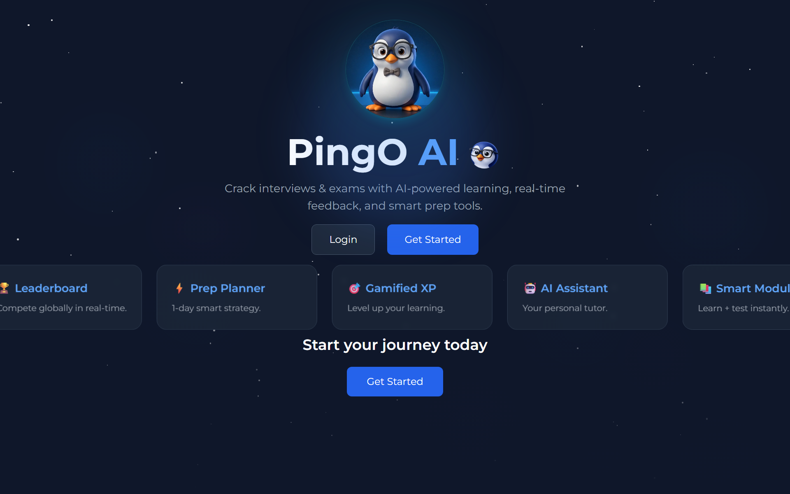
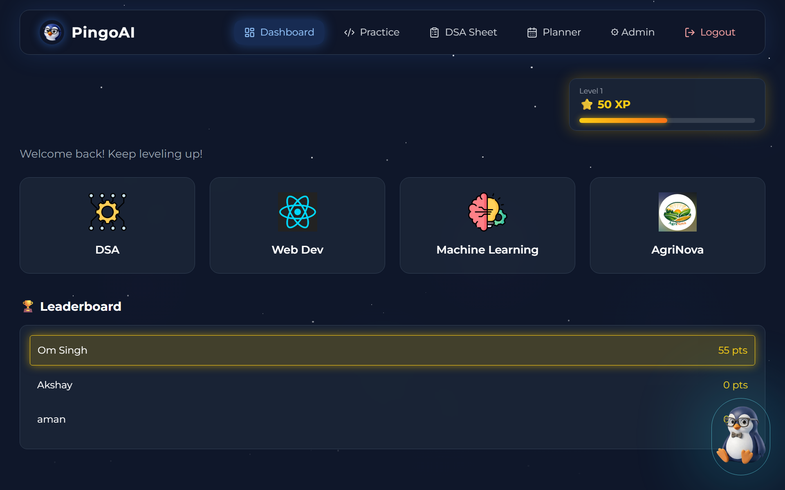
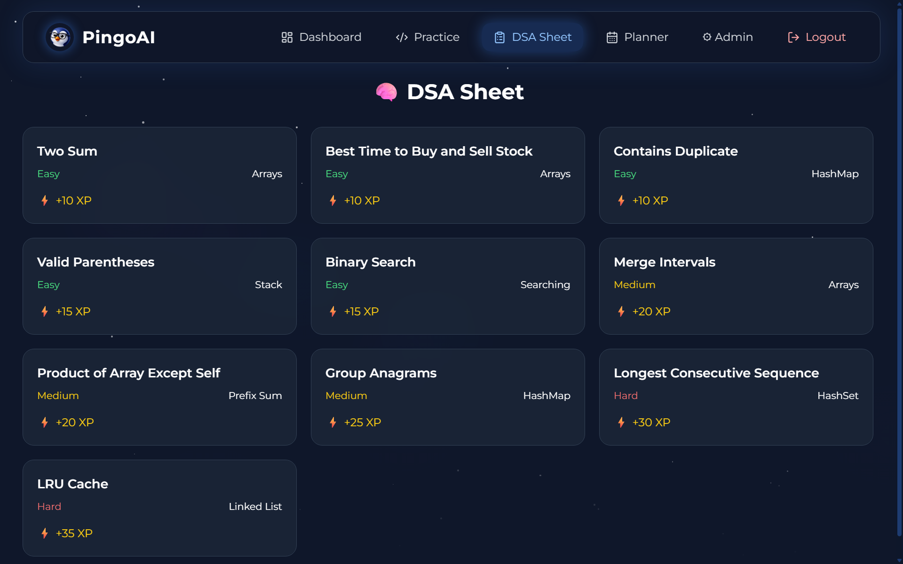
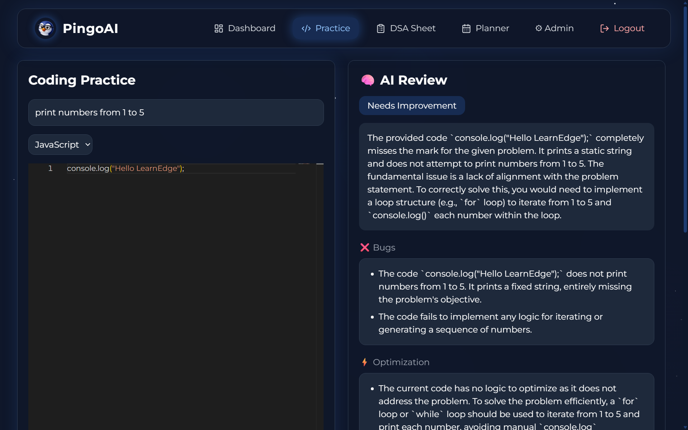
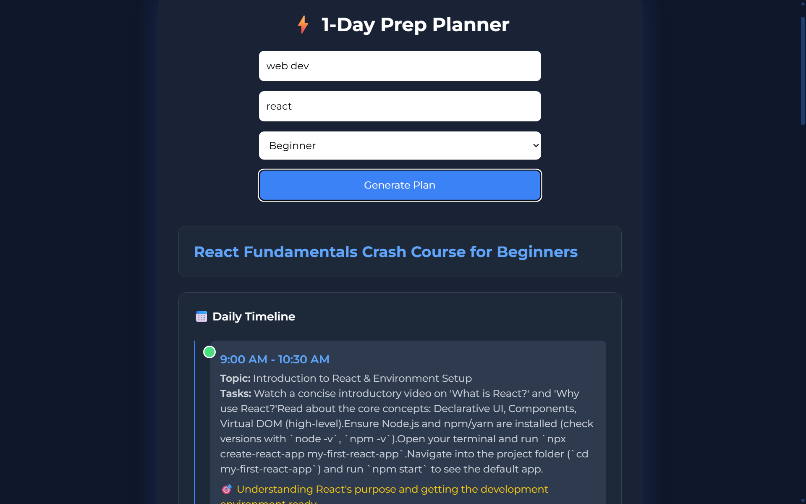
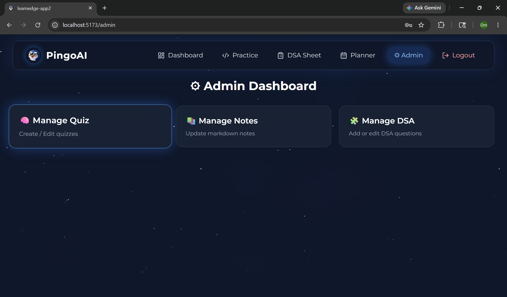

# PingO AI

An AI-powered learning and interview preparation platform designed to make learning interactive, intelligent, and gamified.

PingO combines AI assistance, code review, quizzes, DSA practice, study planning, and gamification into a single learning experience.

---

## ✨ Features

### 🧠 AI Code Review
- AI-powered code analysis
- Detect issues and suggest improvements
- Fixed code suggestions
- Hints and explanations
- XP rewards system

### 📚 Smart Learning Modules
- Topic-wise learning modules
- Interactive notes
- Markdown note viewer
- Quiz integration

### 🎯 DSA Sheet
- Curated DSA problems
- One-click practice redirection
- Auto-fill problem statements
- Difficulty levels + XP rewards

### ⚡ AI Prep Planner
- Generate practical study plans
- Personalized preparation strategy
- Topic-based scheduling

### 🏆 Gamification
- XP system
- Levels
- Streak tracking
- Leaderboards
- Achievement feeling through progression

### 👨‍💻 Admin Panel
- Manage quizzes
- Add/update questions
- CRUD operations
- Content management

### 🤖 AI Assistant
- Personalized assistance
- Smart recommendations

---

# 🛠 Tech Stack

## Frontend

- React.js
- TailwindCSS
- Framer Motion
- Zustand
- React Router

## Backend

- Node.js
- Express.js
- MongoDB
- Mongoose
- JWT Authentication

## AI

- Google Gemini API

---

# 📸 Screenshots

## Home Page



---

## Dashboard



---

## DSA Sheet



---

## Practice Page



---

## Prep Planner



---

## Admin Panel



---

# ⚙ Installation

Clone repository:

```bash
git clone https://github.com/omsingh-blip/LearnEdge-Pingo
```

Move into project:

```bash
cd pingo-ai
```

Install frontend dependencies:

```bash
npm install
```

Install backend dependencies:

```bash
cd backend
npm install
```

---

# 🔑 Environment Variables

Create:

```bash
backend/.env
```

Add:

```env
PORT=5000

MONGO_URI=your_mongodb_connection

JWT_SECRET=your_secret_key

GEMINI_API_KEY=your_gemini_api_key
```

---

# ▶ Run Project

Backend:

```bash
cd backend
npm run dev
```

Frontend:

```bash
npm run dev
```

---

# 📁 Project Structure

```bash
PingO-AI/
│
├── frontend/
│   ├── src/
│   │   ├── components/
│   │   ├── pages/
│   │   ├── services/
│   │   ├── hooks/
│   │   ├── store/
│   │   └── data/
│   │
│   └── public/
│
├── backend/
│   ├── controllers/
│   ├── routes/
│   ├── middleware/
│   ├── models/
│   └── utils/
│
├── screenshots/
│
└── README.md
```

---

# 🎯 Future Improvements

- Multi-language code execution
- Live coding contests
- AI-generated notes
- Interview simulator
- Real analytics dashboard
- Collaborative study rooms
- Dark/light theme switch

---

# 👨‍💻 Author

Om Singh

GitHub:
https://github.com/omsingh-blip

---

⭐ If you like this project, give it a star.